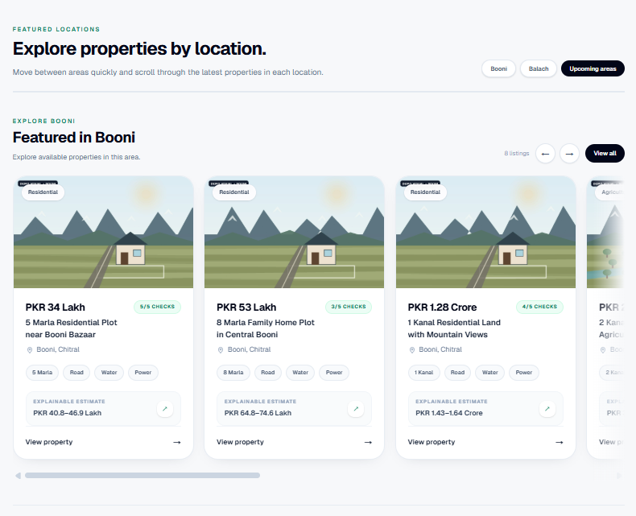

<p align="center">
  
</p>

<h1 align="center">Khak-e-Wathan</h1>

<p align="center">
  <strong>Property discovery for Chitral</strong><br/>
  A hackathon project by <strong>JourneyMen</strong>
</p>

<p align="center">
  <a href="https://khak-e-wathan.vercel.app/"><strong>Live Web App</strong></a>
  &nbsp;•&nbsp;
  <a href="https://khak-e-wathan-production.up.railway.app/health"><strong>ML API Health</strong></a>
</p>

<p align="center">
  
  
  
  
  
  
  
</p>

---

## At a Glance

| Item | Details |
| --- | --- |
| **Team** | JourneyMen |
| **Project** | Khak-e-Wathan |
| **Purpose** | Property discovery and information bridge for Chitral |
| **Current Demo Areas** | Booni and Balach |
| **Frontend Deployment** | [khak-e-wathan.vercel.app](https://khak-e-wathan.vercel.app/) |
| **ML Valuation API** | [Railway FastAPI service](https://khak-e-wathan-production.up.railway.app/health) |
| **Backend** | Supabase PostgreSQL, Auth and Storage |
| **AI Search** | OpenAI-assisted search + deterministic fallback parser |
| **Maps** | Leaflet + React Leaflet + OpenStreetMap |

---

## Team — JourneyMen

| Role | Member |
| --- | --- |
| **Team Lead** | **Ali Shan** |
| Team Member | Muhammad Mazhar Faheem |
| Team Member | Syed Mafaz Ali Shah |

---

## The Problem

Property discovery in Chitral is still largely handled through traditional methods.

A buyer may need to contact people individually, depend on personal connections, visit different areas, or do a lot of separate research before finding useful property information.

Even when a property is available, important details such as price, land size, access, utilities, terrain, location and verification may be scattered or unavailable in one place.

**This makes the process slower and less transparent for both buyers and sellers.**

---

## Our Solution

**Khak-e-Wathan is a digital bridge between property sellers and buyers in Chitral.**

Sellers can create structured listings with photos, location, access, utility and land information. Buyers can discover those listings through search, filters, maps and detailed **Property Passports**.

> **Khak-e-Wathan is not an online property shop.**
>
> It does not process property payments, transfer ownership, or replace legal due diligence. Its role is to improve the **property discovery and information stage** and help buyers and sellers find each other more efficiently.

The current hackathon demo focuses on **Booni and Balach**, while the platform is designed to expand to more locations across Chitral.

---

## Platform Preview

<p align="center">
  
</p>

The marketplace presents properties in a consistent format with price, land size, access, utilities, verification progress and estimated value.

---

## Core Features

- **Property marketplace** for residential, agricultural and commercial listings
- **Natural-language property search**
- Manual filters for location, budget and property features
- **Interactive property map**
- Structured **Property Passport**
- Road, water, electricity, irrigation and internet information
- Privacy-protected approximate public locations
- Evidence notes, reviewer provenance and verification progress
- Private buyer viewing requests
- Seller listing and photo-upload workflow
- Seller inquiry dashboard and listing lifecycle controls
- Admin approval / rejection workflow
- Explainable value guidance
- **ML-assisted valuation**
- Supabase authentication and role-based access

---

## Interactive Property Map

Khak-e-Wathan uses **Leaflet**, **React Leaflet** and **OpenStreetMap** for geographic property discovery.

Buyers can:

- explore listings geographically
- view properties as map markers
- zoom and move around the Chitral region
- select a marker and open its property listing
- combine map exploration with filters
- view an individual property's approximate location

> Public map markers are deterministically offset and rounded. Exact seller-submitted coordinates remain available only in private seller and administrator workflows. Map locations are **not legal parcel boundaries, cadastral records or survey data**.

---

## AI & ML Features

### 1. AI-Assisted Natural-Language Search

A buyer can write:

```text
residential land in Booni under 50 lakh with electricity
```

The OpenAI-powered search interpreter converts the request into validated filters such as location, property type, budget and utilities.

The AI **does not generate or invent property listings**. The final results come from the actual records stored in Supabase.

### 2. Deterministic Fallback Search

Search does not completely depend on the OpenAI API.

A custom TypeScript fallback parser can interpret common requests involving:

- locations such as Booni and Balach
- residential, agricultural and commercial property
- lakh / crore price expressions
- minimum and maximum budgets
- road access
- water and electricity
- irrigation
- internet quality
- negative requests such as **“without electricity”**

The fallback can take over if:

- no OpenAI API key is configured
- the AI request fails
- the network is unavailable
- the model response is invalid
- API/model availability changes

So property search remains usable instead of failing completely.

### 3. ML-Assisted Valuation

Khak-e-Wathan includes a separate Python valuation service.

The model uses structured property characteristics including:

- location
- property type
- land area
- road access
- distance from the main road
- utilities
- internet quality
- terrain and slope
- residential / agricultural suitability

The current prototype uses a **Random Forest Regressor** built with scikit-learn.

It is exposed through a **FastAPI** service and deployed independently on **Railway**:

**ML API:** https://khak-e-wathan-production.up.railway.app

For the hackathon prototype, the model is trained using **synthetic demonstration data**, so its estimates are not professional appraisals or verified Chitral market prices.

The transparent rule-based estimate is the primary product guidance. The Random Forest result demonstrates a separately deployed ML pipeline and should be presented as a synthetic comparison rather than market evidence.

---

## How Search Stays Grounded

### With AI available

```text
Buyer request
     ↓
OpenAI search interpreter
     ↓
Validated filters
     ↓
Supabase property query
     ↓
Stored property listings
```

### If AI is unavailable

```text
Buyer request
     ↓
Deterministic fallback parser
     ↓
Validated filters
     ↓
Supabase property query
     ↓
Stored property listings
```

**Supabase remains the source of truth in both cases.**

---

## Deployment

Khak-e-Wathan is split into independently deployed services.

| Component | Platform | Deployment |
| --- | --- | --- |
| Web application | **Vercel** | [khak-e-wathan.vercel.app](https://khak-e-wathan.vercel.app/) |
| Database | **Supabase PostgreSQL** | Managed Supabase backend |
| Authentication | **Supabase Auth** | Managed Supabase backend |
| Property images | **Supabase Storage** | Managed Supabase storage |
| AI search | **OpenAI API** | Called server-side by the Next.js application |
| ML valuation service | **Railway** | [khak-e-wathan-production.up.railway.app](https://khak-e-wathan-production.up.railway.app/) |
| ML API health endpoint | **Railway** | [/health](https://khak-e-wathan-production.up.railway.app/health) |

This separation keeps the web interface, database and ML service independent while allowing them to work together through APIs.

---

## Tech Stack

| Area | Technology |
| --- | --- |
| Frontend | **Next.js 16**, React 19, TypeScript |
| Styling | **Tailwind CSS 4** |
| Maps | **Leaflet**, React Leaflet, OpenStreetMap |
| Database | **Supabase PostgreSQL** |
| Authentication | **Supabase Auth** |
| Image Storage | **Supabase Storage** |
| Security | Supabase **Row Level Security (RLS)** + server-side RPC functions |
| AI Search | **OpenAI Responses API** with structured output |
| Search Fallback | Custom deterministic **TypeScript parser** |
| Machine Learning | **Python**, pandas, scikit-learn, Random Forest |
| ML API | **FastAPI** |
| Frontend Hosting | **Vercel** |
| ML Hosting | **Railway** |
| Version Control | **Git + GitHub** |

---

## System Architecture

<p align="center">
  
</p>

```text
Buyers / Sellers / Admins
            │
       Next.js App
         (Vercel)
            │
   ┌────────┼────────┐
   │        │        │
Supabase  OpenAI   ML API
   │                │
Postgres          FastAPI
Auth              Railway
Storage           Random Forest
```

---

## Property Passport

Each listing contains more than a title and price.

A Property Passport can show:

- property type
- asking price
- land size
- road access
- distance from the main road
- water source
- electricity
- irrigation
- connectivity
- terrain and slope
- approximate map location
- verification progress
- value guidance

This helps buyers understand a property before deciding whether to investigate it further in the real world.

---

## Seller & Admin Workflow

### Seller

```text
Sign In
→ Property Details
→ Approximate Location
→ Upload Photos
→ Review
→ Submit
→ Receive Private Viewing Requests
→ Mark Sold / Archive
```

### Admin

```text
Moderation Queue
→ Open Listing
→ Review Information and Evidence Notes
→ Record Reviewer and Date
→ Approve / Reject
```

Rejected listings can be edited and resubmitted.

---

## Demo Data & Important Disclaimer

The current hackathon catalogue uses **synthetic demonstration data**.

This includes demo:

- listings
- prices
- coordinates
- verification states
- representative property visuals
- ML training data

Approximate map points are not cadastral or legal parcel boundaries.

The public application receives an offset and rounded discovery point rather than the precise seller-submitted coordinates.

The valuation feature is a prototype and must not be treated as a professional property appraisal.

---

## Run Locally

### Web App

```bash
npm install
npm test
npm run typecheck
npm run dev
```

Create `.env.local`:

```env
NEXT_PUBLIC_SUPABASE_URL=
NEXT_PUBLIC_SUPABASE_PUBLISHABLE_KEY=

OPENAI_API_KEY=
OPENAI_SEARCH_MODEL=

ML_API_URL=
```

Never commit real secret keys.

### Supabase Database

The complete schema, Row Level Security policies, storage policies and RPC functions are versioned in:

```text
supabase/migrations/20261005013000_initial_schema.sql
```

Apply the migration before starting the application:

```bash
supabase link --project-ref <your-project-ref>
supabase db push
```

If the Supabase CLI is unavailable, run the migration file once in the Supabase SQL editor.

To install the synthetic hackathon catalogue:

1. Run `sql/01_reset_and_seed.sql`.
2. Add `SUPABASE_SERVICE_ROLE_KEY` to a temporary local `.env.local`.
3. Run `node scripts/upload-demo-images.mjs`.
4. Remove the service-role key immediately.
5. Run `sql/02_verify_seed.sql`.

The reset and image-upload scripts are intentionally destructive and must only be used against the dedicated demo project.

To create or reset one seller and one administrator account, fill the
`DEMO_*` values in `.env.local` and run:

```bash
npm run demo:users
```

The script confirms both emails, applies the requested passwords, and assigns
the correct profile roles. Remove the service-role key immediately afterward.

### Validation

```bash
npm test
npm run typecheck
npm run lint
npm run build
python -m compileall -q ml
```

### Optional Local ML Service

```bash
pip install -r ml/requirements.txt
python ml/train_model.py
uvicorn ml.api:app --reload
```

Then use:

```env
ML_API_URL=http://127.0.0.1:8000
```

---

## Future Scope

The current demo uses **Booni and Balach**, but the platform structure is Chitral-wide.

Future improvements could include:

- more Chitral locations and verified listings
- real historical transaction data for stronger valuation
- deeper property verification
- local market analytics
- buyer / seller communication tools
- stronger low-bandwidth support
- richer geographic intelligence

---

## Why Khak-e-Wathan?

The goal is not to turn a property transaction into an online checkout.

The goal is to make the **first stage of finding and understanding property much easier**.

Khak-e-Wathan gives buyers one place to discover and evaluate property information, while giving sellers a structured way to present what they are offering.

<p align="center">
  <strong>Khak-e-Wathan — Land decisions, made clearer.</strong>
</p>
