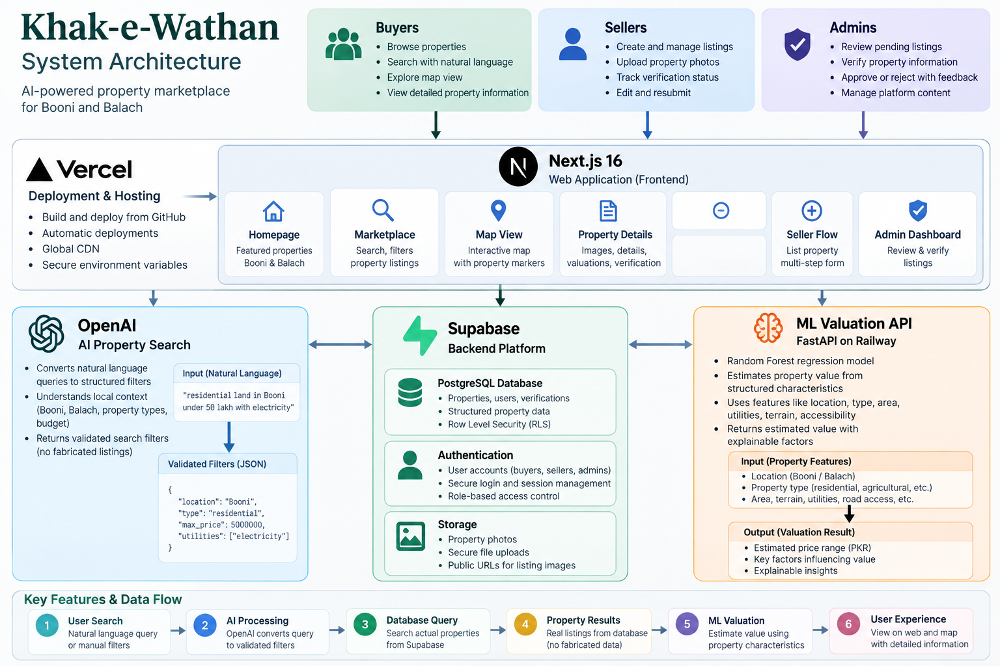
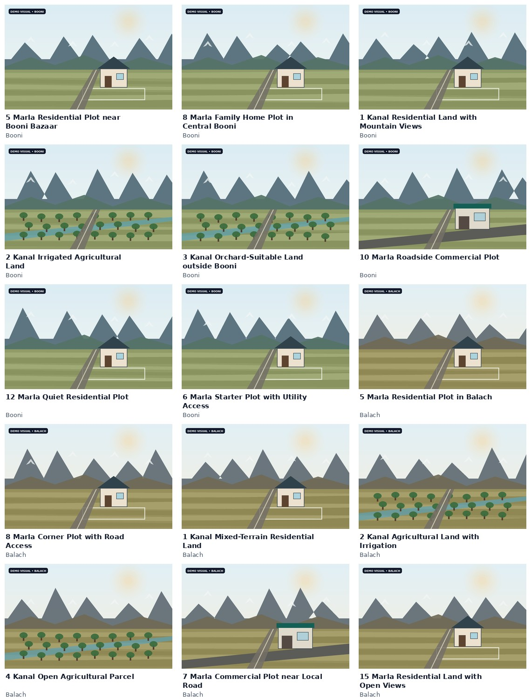

<p align="center">
  
</p>

<h1 align="center">Khak-e-Wathan</h1>

<p align="center">
  <strong>Property discovery for Chitral</strong><br/>
  A hackathon project by <strong>JourneyMen</strong>
</p>

<p align="center">
  <a href="https://khak-e-wathan.vercel.app/"><strong>Live Demo</strong></a>
</p>

<p align="center">
  
  
  
  
  
</p>

---

## Team — JourneyMen

| Role | Member |
| --- | --- |
| **Team Lead** | **Ali Shan** |
| Team Member | Muhammad Mazhar Faheem |
| Team Member | Syed Mafaz Ali Shah |

---

## The Problem

Property discovery in Chitral is still largely handled through traditional methods: contacting people, asking around, relying on personal networks, visiting areas physically, or doing a lot of separate research before finding useful information.

Even when a property is available, important details such as road access, utilities, terrain, approximate location, verification status, and expected value may be scattered or unavailable in one place.

This makes the process slower and less transparent for both buyers and sellers.

---

## Our Solution

**Khak-e-Wathan is a digital bridge between property sellers and buyers in Chitral.**

Sellers can create structured listings with photos, location, access, utilities and land information. Buyers can explore those listings through search, filters, maps and detailed **Property Passports**.

> **Khak-e-Wathan is not an online property shop.**
>
> The platform does not sell land, process payments, transfer ownership, or replace legal due diligence. It helps people **discover and understand properties more easily** before they continue the real-world negotiation and legal process.

The current demo focuses on **Booni and Balach**, while the data model and search system are designed to expand to more locations across Chitral.

---

## Key Features

- **Property marketplace** with residential, agricultural and commercial listings
- **Natural-language property search**
- **Manual search filters** for location, price and property features
- **Interactive Leaflet map** with property markers
- **Property Passport** with structured land information
- **Road, water, electricity, irrigation and internet details**
- **Approximate property location** with map guardrails
- **Verification workflow** with visible verification status
- **Seller workflow** for draft → photos → review → submission
- **Admin moderation** for review, verification, approval and rejection
- **Explainable value guidance**
- **Machine-learning assisted valuation**
- Authentication and role-based access through Supabase

> Verification information helps users understand which checks have been completed. It does not replace formal legal or ownership verification.

---

## AI Features

### 1. AI-assisted natural-language search

A buyer can write a normal request such as:

```text
residential land in Booni under 50 lakh with electricity
```

The OpenAI-powered search interpreter converts that sentence into a validated set of filters such as:

- location
- property type
- minimum / maximum price
- road access
- water
- electricity
- irrigation
- internet quality

The AI **does not generate or invent listings**. After interpreting the query, Khak-e-Wathan searches the actual properties stored in Supabase.

### 2. Built-in fallback search system

The search feature is deliberately designed to keep working even when the AI service is unavailable.

A deterministic fallback parser is always available and can understand common search patterns including:

- Booni, Balach, Chitral City, Drosh, Mastuj and Reshun
- residential, agricultural and commercial property
- Pakistani price expressions such as **lakh** and **crore**
- minimum and maximum budgets
- road access
- water and electricity
- irrigation
- internet quality
- explicit requests such as “without electricity”

The fallback is used when, for example:

- no OpenAI API key is configured
- the AI request fails
- the network is unavailable
- the model returns an invalid response
- model access changes

This means property search still works instead of failing completely.

### 3. ML-assisted valuation

Khak-e-Wathan also includes a Python machine-learning service that estimates property value from structured characteristics such as:

- location
- property type
- area
- road access
- distance from the main road
- utilities
- internet quality
- terrain and slope
- residential / agricultural suitability

The model uses a **Random Forest Regressor** built with scikit-learn and is served through a **FastAPI** service deployed on Railway.

For the hackathon prototype, the ML model is trained on **synthetic demonstration data**, so its output must not be treated as a professional appraisal or verified Chitral market price.

---

## How Search Stays Grounded

```text
Buyer writes a natural-language request
                ↓
        AI search interpreter
                ↓
         Validated filters
                ↓
      Supabase property query
                ↓
       Real stored listings
```

If the AI interpreter is unavailable:

```text
Buyer request
     ↓
Deterministic fallback parser
     ↓
Validated filters
     ↓
Supabase property query
```

The database remains the source of truth in both cases.

---

## Tech Stack

| Area | Technology |
| --- | --- |
| Frontend | **Next.js 16**, React 19, TypeScript |
| Styling | **Tailwind CSS 4** |
| Maps | **Leaflet**, React Leaflet, OpenStreetMap |
| Database | **Supabase PostgreSQL** |
| Authentication | **Supabase Auth** |
| File Storage | **Supabase Storage** |
| Database Security | Supabase **Row Level Security (RLS)** + server-side RPC functions |
| AI Search | **OpenAI Responses API** with structured output |
| Search Resilience | Custom deterministic TypeScript fallback parser |
| ML | **Python**, pandas, scikit-learn, Random Forest |
| ML API | **FastAPI** |
| Frontend Hosting | **Vercel** |
| ML Hosting | **Railway** |
| Version Control | **Git + GitHub** |

---

## Architecture

<p align="center">
  
</p>

At a high level:

```text
Buyers / Sellers / Admins
            │
       Next.js App
         (Vercel)
            │
   ┌────────┼────────┐
   │        │        │
Supabase  OpenAI   ML API
   │                │
Postgres          FastAPI
Auth              Railway
Storage           Random Forest
```

---

## Demo Catalogue

<p align="center">
  
</p>

The hackathon demo currently uses synthetic listings and representative demo imagery so the complete product flow can be demonstrated without presenting test data as genuine market inventory.

---

## Demo Data & Important Disclaimer

The current hackathon dataset is **synthetic**.

This includes demo:

- listings
- asking prices
- coordinates
- verification states
- property images
- ML training data

Approximate map points are for demonstration and are **not cadastral parcel boundaries**.

The valuation system is a prototype and should not be used as a professional property appraisal.

---

## Main User Flows

### Buyer

```text
Homepage
→ Search / Filters
→ Property Results
→ Map
→ Property Passport
→ Verification + Value Guidance
```

### Seller

```text
Sign In
→ Property Details
→ Approximate Location
→ Upload Photos
→ Review
→ Submit for Admin Review
```

### Admin

```text
Moderation Queue
→ Open Listing
→ Review Information
→ Update Verification Checks
→ Approve / Reject
```

---

## Running Locally

### 1. Install dependencies

```bash
npm install
```

### 2. Create `.env.local`

```env
NEXT_PUBLIC_SUPABASE_URL=
NEXT_PUBLIC_SUPABASE_PUBLISHABLE_KEY=

OPENAI_API_KEY=
OPENAI_SEARCH_MODEL=

ML_API_URL=
```

Never commit real secret keys.

### 3. Run the Next.js app

```bash
npm run dev
```

Then open:

```text
http://localhost:3000
```

### 4. Optional: run the ML service locally

```bash
pip install -r ml/requirements.txt
python ml/train_model.py
uvicorn ml.api:app --reload
```

Then set:

```env
ML_API_URL=http://127.0.0.1:8000
```

---

## Project Scope

Khak-e-Wathan currently demonstrates the platform with **Booni and Balach** listings.

The project is structured so additional Chitral locations can be introduced without rebuilding the core platform.

Possible future improvements include:

- more verified Chitral locations and listings
- real historical transaction data for stronger valuation models
- deeper property verification workflows
- improved local market analytics
- richer seller/buyer communication tools
- better low-bandwidth and offline-friendly support

---

## Why Khak-e-Wathan?

The goal is not to move an offline property transaction completely onto the internet.

The goal is to make the **discovery and information stage** much better.

Khak-e-Wathan gives buyers a clearer place to search and understand property information, while giving sellers a structured way to present what they are offering.

<p align="center">
  <strong>Khak-e-Wathan — Land decisions, made clearer.</strong>
</p>
